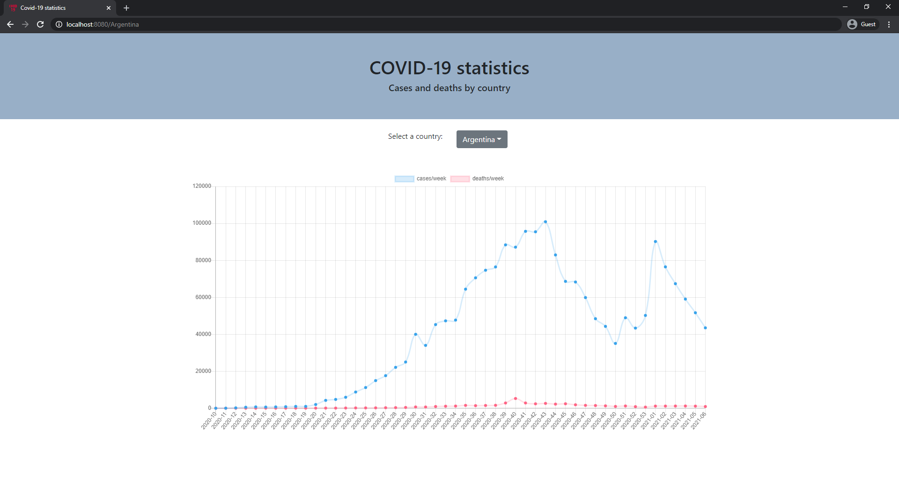

# Covid-19 statistics

## Application screenshots
* All countries

* One country

* Information on hover


## Technology stack & other Open-source libraries
### Data
* [H2](https://www.h2database.com/html/main.html) - Java SQL database
### Frontend
* [React](https://reactjs.org/)
* [Bootstrap4](https://getbootstrap.com/docs/4.6/getting-started/introduction/)
### Backend
* [JDK 11](https://www.oracle.com/java/technologies/javase-jdk11-downloads.html)
* [Spring Boot](https://spring.io/projects/spring-boot)
* [Maven](https://maven.apache.org/)
### Others
* [Swagger](https://swagger.io/)
* [git](https://git-scm.com/)
* [Docker](https://www.docker.com/)
* [Chart.js](https://www.chartjs.org/docs/latest/) & [react-chartjs-2](https://github.com/reactchartjs/react-chartjs-2)

## Running application
### Running the application with Maven
Alternatively you can use the [Spring Boot Maven plugin](https://docs.spring.io/spring-boot/docs/current/reference/html/build-tool-plugins.html#build-tool-plugins-maven-plugin) like so:
```shell
$ git clone https://github.com/Lamista/covid-19.git
$ cd covid-19/app
$ mvn spring-boot:run
```
### Running the application with Executable JAR
The code can also be built into a jar and then executed/run. Once the jar is built, run the jar by double clicking on it or by using the command
```shell
$ git clone https://github.com/Lamista/covid-19.git
$ cd covid-19/app
$ mvn package -DskipTests
$ java -jar target/app.jar --spring.profiles.active=test
```
To shutdown the jar, follow the below mentioned steps on a Windows machine.
* In command prompt execute the jcmd command to print a list of all running Java processes
* `Taskkill /PID PROCESS_ID_OF_RUNNING_APP /F` execute this command by replacing the PROCESS_ID_OF_RUNNING_APP with the actual process id of the running jar found out from executing the previous command

### Accessing Data in H2 Database
[http://localhost:8080/console](http://localhost:8080/console)
* JDBC URL: jdbc:h2:mem:app
* User Name: sa
* Password:
```

```
### Running the application via docker container
```shell
$ git clone https://github.com/Lamista/covid-19.git
$ cd covid-19/app
$ docker build -t app .
$ docker run -dp 8080:8080 app
```
### Swagger
[http://localhost:8080/swagger-ui/](http://localhost:8080/swagger-ui/)
* GET list of country name - "/api/data/countries", request URL [http://localhost:8080/api/data/countries](http://localhost:8080/api/data/countries)
* GET lists of weeks while collecting data, number of cases and deaths of one country - "/api/data/{country}", request URL for Russia [http://localhost:8080/api/data/Russia](http://localhost:8080/api/data/Russia)
* GET lists of weeks while collecting data, number of cases and deaths of all countries - "/api/data/all-countries", request URL [http://localhost:8080/api/data/all-countries](http://localhost:8080/api/data/all-countries)
* GET all data - "/api/data/all", request URL [http://localhost:8080/api/data/all](http://localhost:8080/api/data/all)


## Copyright
&copy;LauraStasiule